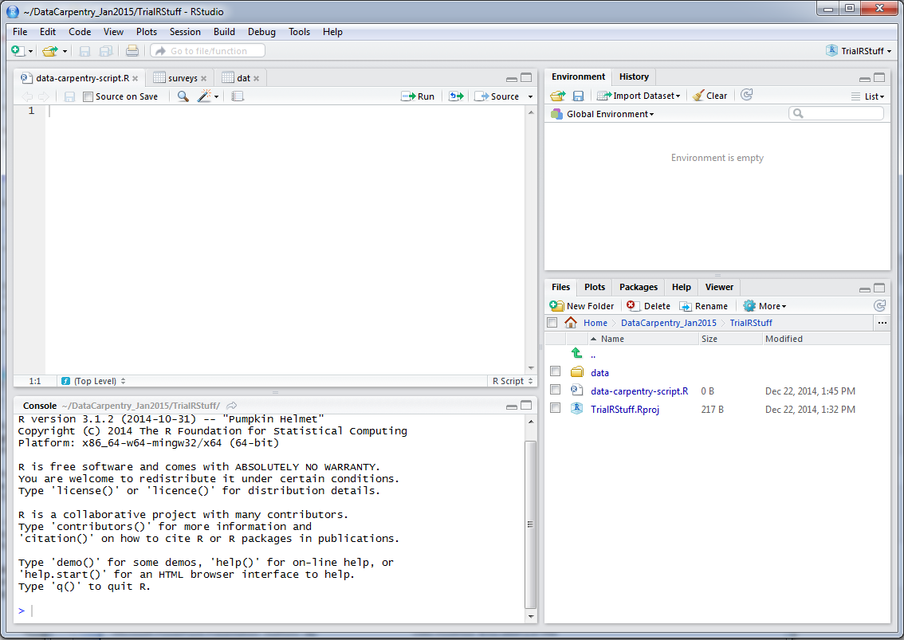

```{r, echo=FALSE, purl=FALSE}
knitr::opts_chunk$set(results='hide', fig.path='img/r-lesson-')
```

> ## Learning Objectives
>
> * Articulating motivations for this lesson
> * Introduce participants to the RStudio interface
> * Set up participants to have a working directory with a `data/` folder inside


# Basics of R

R is a versatile, open source programming/scripting language that's useful both
for statistics but also data science. Inspired by the programming language S.

* Open source software under GPL. FREE
* Superior (if not just comparable) to commercial alternatives. R has over 7,000
  user contributed packages at this time. It's widely used both in academia and
  industry.
* Available on all platforms.
* Not just for statistics, but also general purpose programming.
* Is object oriented and functional.
* Reproducible Research- Data Management, Analysis/Code, and Manuscript Preparation
* Large and growing community of peers.


Let's start by learning about our tool.

_Point out the different windows in R._



* Lower Left: **Console**
    + this is where everything is executed
    + you can type into here and press enter to execute
* Upper Left: **Scripts**
    + this is where you compose the ordered execution of code that works well
    + highlight a chunk, and press "run" or Ctrl+R or Ctrl+Enter to execute
        + if your cursor is anywhere on the line it will run the whole line and advance the cursor to the next line
    + this is what you __write__ and save to be executed at any time in the future
* Upper Right: 
    + **Environment** 
        + a list of all the variables, datasets, model outputs ("objects") that you've created *this session only*
        + provides ways to explore the values of these things
    + **History**
        + A list of all commands executed in the console (without the output)
* Lower Right: (Everything else)
    + **Files**
        + A view of the project folder- what is available to you?
        + also called the "working directory" - it's where you are working now
    + **Plots**
        + This is where your plots will show up when you make them
    + **Packages**
        + A list of all the "add on" packages that you can use and which you have loaded for use in this session
    + **Help**
        + Where the help will show up.  
        + search from the textbox 
        + get help for a function (e.g. `mean`) by typing `?mean` in the console
    + **Viewer**
        + This is advanced, don't worry about this now
        

# Setup

* Start RStudio (presentation of RStudio -below- should happen here)
* Under the `File` menu, click on `New project`, choose `New directory`, then
  `Empty project`
* Enter a name for this new folder, and choose a convenient location for
  it. This will be your **working directory** for the rest of the day
  (e.g., `~/data-carpentry`)
* Click on "Create project"
* Under the `Files` tab on the right of the screen, click on `New Folder` and
  create a folder named `data` within your newly created working directory.
  (e.g., `~/data-carpentry/data`)
* Create a new R script (File > New File > R script) and save it in your working
  directory (e.g. `data-carpentry-script.R`)

Your working directory should now look like this:


Note that this is just a convenient way of viewing what is in this folder. Go to your windows browser to see how these mirror each other. 

